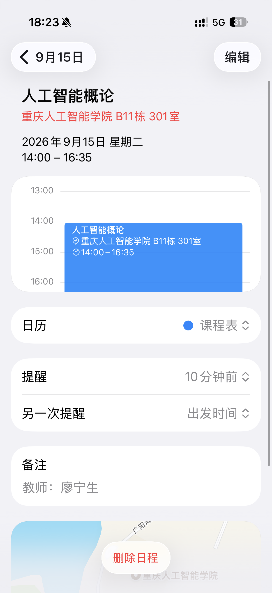

# schedule2ics

把中文课表一键转成 .ics 日历文件，拖进手机/电脑日历即可导入。

- 零依赖，只用 Python 标准库
- 支持单周 / 双周 / 跳周（如 `1-16/2`、`2-8,10-16`）
- 支持跨节次自动拆分日程（如 `1-2,5-6`）
- 可自定义作息时间表与课后提醒

## 用法

1. 复制 courses.example.py 为 my_courses.py，按注释填写自己的课表
2. 修改 schedule2ics.py 顶部的 FIRST_MONDAY（开学第一周的周一）
3. python3 schedule2ics.py
4. 打开生成的 .ics 文件，或发到手机导入

## 配置示例
  {
      "name":     "人工智能概论",     # 课程名（必填）
      "teacher":  "廖老师",           # 老师（可留空 ""）
      "location": "B11栋 301室",      # 地点（可留空 ""）
      "weeks":    "2-17",             # 第几周上课
      "weekday":  "周三",             # 星期几
      "periods":  "5-7",              # 第几节到第几节
  }

  weeks  写法： "5"          只有第 5 周
                "2-17"       第 2 到 17 周（每周都有）
                "1-16/2"     第 1 到 16 周里的单数周
                "6-16/2"     第 6 到 16 周里的双数周
                "5,7,9"      第 5、7、9 周
                "2-8,10-16"  第 2-8 周 + 第 10-16 周

  weekday 写法： 周一 周二 周三 周四 周五 周六 周日
                （也可以写 1~7，1 = 周一）

  periods 写法： "3"          第 3 节
                "5-7"        第 5 到 7 节
                "1-2,5-6"    第 1-2 节 和 第 5-6 节（自动拆成两个日程）

## License
MIT

## 效果图

.PNG)
